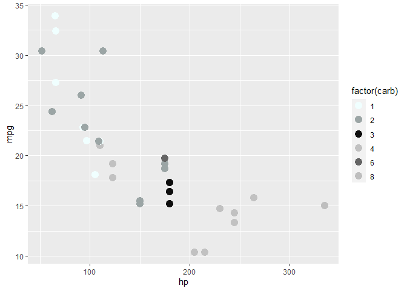
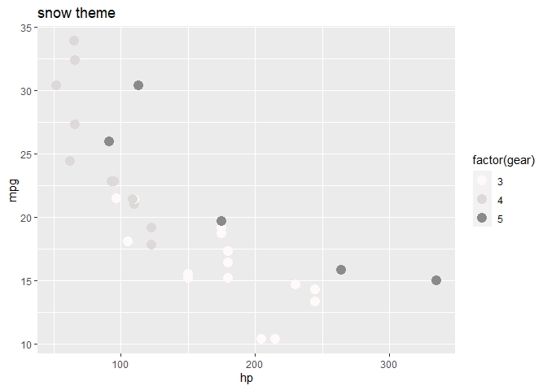
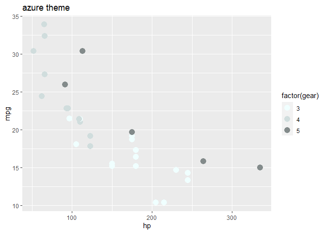
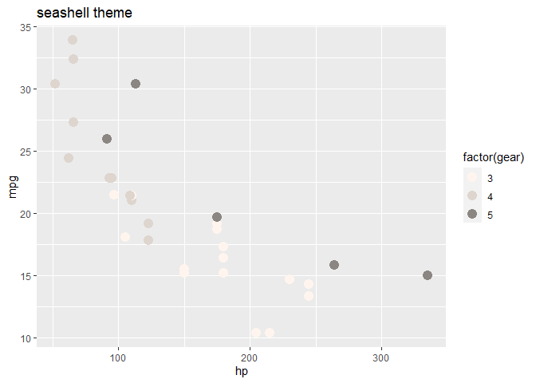
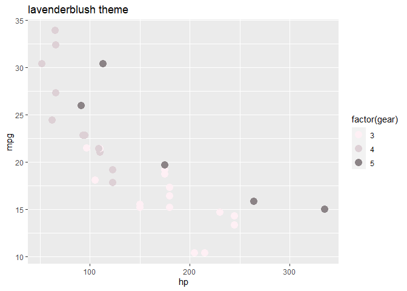
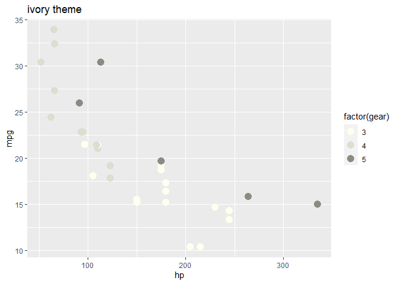
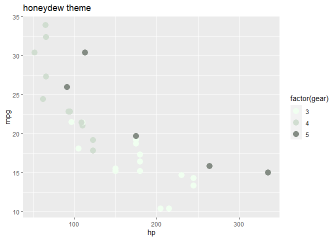
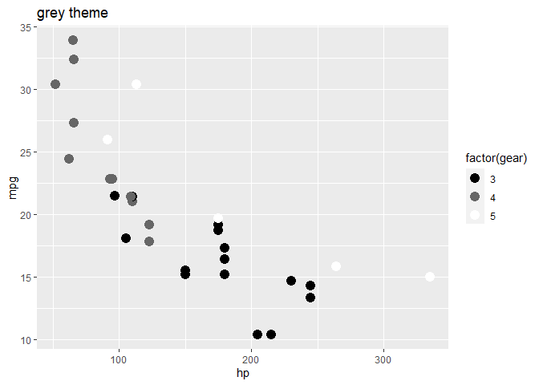

<!-- README.md is generated from README.Rmd. Please edit that file -->

# fiftyshadesofgrey

<!-- badges: start -->
<!-- badges: end -->

There is nothing wrong with some old fashion. This package, offers
different black and white palettes to add to all your graphs and plots,
to give some of that old fashion vibe back into a modern era.

## Installation

You can install the development version of fiftyshadesofgrey like so:

``` r
devtools::install_github("arthur1timmermans/fiftyshadesofgrey")
library(fiftyshadesofgrey)
```

it is also required to install the following packages to further use
this demo: tidyverse readXL here

## Example

Down bellow, all different color pallets are displayed

``` r
library(fiftyshadesofgrey)
library(tidyverse)
#> -- Attaching packages --------------------------------------- tidyverse 1.3.1 --
#> v ggplot2 3.3.6     v purrr   0.3.4
#> v tibble  3.1.7     v dplyr   1.0.9
#> v tidyr   1.2.0     v stringr 1.4.0
#> v readr   2.1.2     v forcats 0.5.1
#> -- Conflicts ------------------------------------------ tidyverse_conflicts() --
#> x dplyr::filter() masks stats::filter()
#> x dplyr::lag()    masks stats::lag()

ggplot(mtcars, aes(hp, mpg)) +
geom_point(aes(color = factor(gear)), size = 4) +
color_pallete_blackwhite() + 
  labs(title = "default black and white theme")
```



``` r

ggplot(mtcars, aes(hp, mpg)) +
geom_point(aes(color = factor(gear)), size = 4) +
color_pallete_blackwhite(palette = "snow") + 
  labs(title = "snow theme")
```



``` r

ggplot(mtcars, aes(hp, mpg)) +
geom_point(aes(color = factor(gear)), size = 4) +
color_pallete_blackwhite(palette = "azure") + 
  labs(title = "azure theme")
```



``` r

ggplot(mtcars, aes(hp, mpg)) +
geom_point(aes(color = factor(gear)), size = 4) +
color_pallete_blackwhite(palette = "seashell") + 
  labs(title = "seashell theme")
```



``` r

ggplot(mtcars, aes(hp, mpg)) +
geom_point(aes(color = factor(gear)), size = 4) +
color_pallete_blackwhite(palette = "lavenderblush") + 
  labs(title = "lavenderblush theme")
```



``` r

ggplot(mtcars, aes(hp, mpg)) +
geom_point(aes(color = factor(gear)), size = 4) +
color_pallete_blackwhite(palette = "ivory") + 
  labs(title = "ivory theme")
```



``` r

ggplot(mtcars, aes(hp, mpg)) +
geom_point(aes(color = factor(gear)), size = 4) +
color_pallete_blackwhite(palette = "honeydew") + 
  labs(title = "honeydew theme")
```



``` r

ggplot(mtcars, aes(hp, mpg)) +
geom_point(aes(color = factor(gear)), size = 4) +
color_pallete_blackwhite(palette = "gray") + 
  labs(title = "gray theme")
```


``` r

ggplot(mtcars, aes(hp, mpg)) +
geom_point(aes(color = factor(gear)), size = 4) +
color_pallete_blackwhite(palette = "grey") + 
  labs(title = "grey theme")
```


