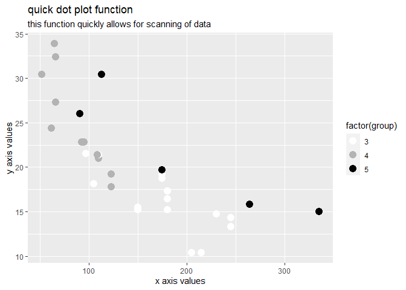
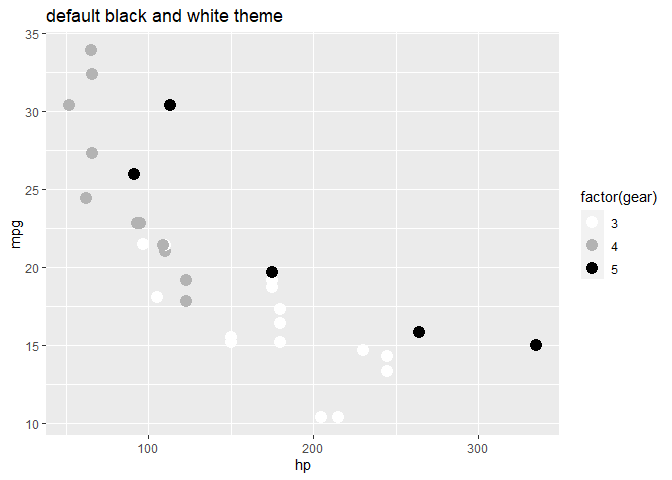
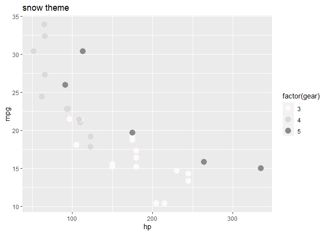
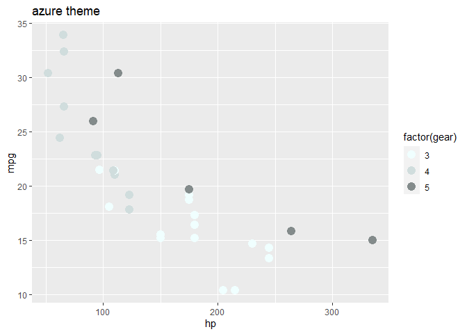
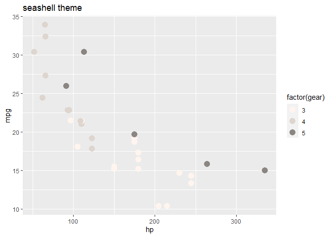
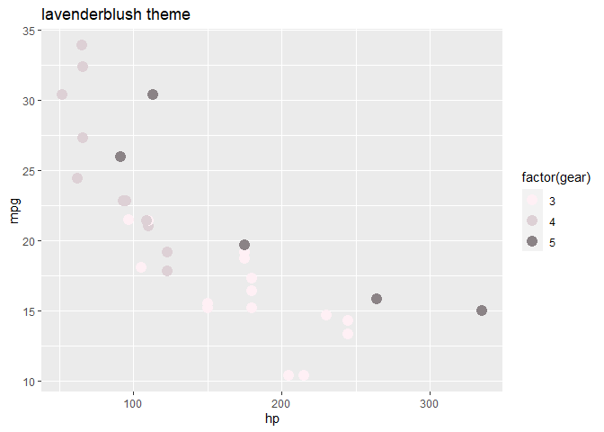
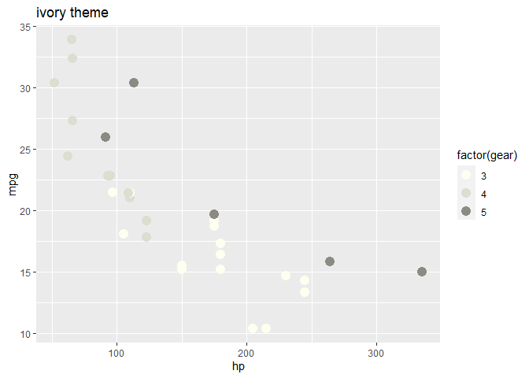
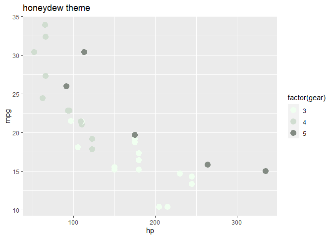
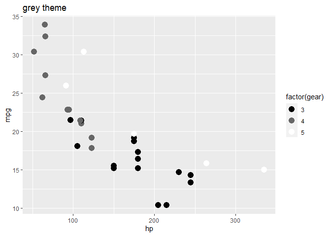

<!-- README.md is generated from README.Rmd. Please edit that file -->

# fiftyshadesofgrey

<!-- badges: start -->
<!-- badges: end -->

There is nothing wrong with some old fashion. This package, offers
different black and white palettes to add to all your graphs and plots,
to give some of that old fashion vibe back into a modern era. Further
more, this package includes a function to quickly generate:

- table/data frame displaying the data types
- a scattered dot plot
- box plot
- line graph
- column graph
- bar graph
- correlation test between 2 variables

this makes it easy and quick to roughly scan through newly imported data
before a proper and tidy analysis will be performed.

## Installation

You can install the development version of fiftyshadesofgrey like so:

``` r
devtools::install_github("arthur1timmermans/fiftyshadesofgrey")
library(fiftyshadesofgrey)
```

it is also required to install the following packages to further use
this demo: tidyverse readXL here

## Example

down bellow a demonstration of the quick functions is given

``` r
library(fiftyshadesofgrey)
library(tidyverse)
#> -- Attaching core tidyverse packages ------------------------ tidyverse 2.0.0 --
#> v dplyr     1.1.0     v readr     2.1.4
#> v forcats   1.0.0     v stringr   1.5.0
#> v ggplot2   3.4.1     v tibble    3.1.8
#> v lubridate 1.9.2     v tidyr     1.3.0
#> v purrr     1.0.1     
#> -- Conflicts ------------------------------------------ tidyverse_conflicts() --
#> x dplyr::filter() masks stats::filter()
#> x dplyr::lag()    masks stats::lag()
#> i Use the ]8;;http://conflicted.r-lib.org/conflicted package]8;; to force all conflicts to become errors

quick_Select_function(mtcars$gear, mtcars$hp, mtcars$mpg)
#>    id group   x    y
#> 1   1     4 110 21.0
#> 2   2     4 110 21.0
#> 3   3     4  93 22.8
#> 4   4     3 110 21.4
#> 5   5     3 175 18.7
#> 6   6     3 105 18.1
#> 7   7     3 245 14.3
#> 8   8     4  62 24.4
#> 9   9     4  95 22.8
#> 10 10     4 123 19.2
#> 11 11     4 123 17.8
#> 12 12     3 180 16.4
#> 13 13     3 180 17.3
#> 14 14     3 180 15.2
#> 15 15     3 205 10.4
#> 16 16     3 215 10.4
#> 17 17     3 230 14.7
#> 18 18     4  66 32.4
#> 19 19     4  52 30.4
#> 20 20     4  65 33.9
#> 21 21     3  97 21.5
#> 22 22     3 150 15.5
#> 23 23     3 150 15.2
#> 24 24     3 245 13.3
#> 25 25     3 175 19.2
#> 26 26     4  66 27.3
#> 27 27     5  91 26.0
#> 28 28     5 113 30.4
#> 29 29     5 264 15.8
#> 30 30     5 175 19.7
#> 31 31     5 335 15.0
#> 32 32     4 109 21.4

graph_function()
```



``` r

correlation_function()
#> [1] "the p. values from x and y of the shapiro test are"
#> [1] 0.04880824
#> [1] 0.1228814
#> [1] "the data was normaly distrubuted, a pearson correlation test was run to compare x and y and the P-value is"
#> [1] -0.7761684
```

Down bellow, all different color pallets are displayed

``` r
library(fiftyshadesofgrey)
library(tidyverse)

ggplot(mtcars, aes(hp, mpg)) +
geom_point(aes(color = factor(gear)), size = 4) +
color_pallete_blackwhite() + 
  labs(title = "default black and white theme")
```



``` r

ggplot(mtcars, aes(hp, mpg)) +
geom_point(aes(color = factor(gear)), size = 4) +
color_pallete_blackwhite(palette = "snow") + 
  labs(title = "snow theme")
```



``` r

ggplot(mtcars, aes(hp, mpg)) +
geom_point(aes(color = factor(gear)), size = 4) +
color_pallete_blackwhite(palette = "azure") + 
  labs(title = "azure theme")
```



``` r

ggplot(mtcars, aes(hp, mpg)) +
geom_point(aes(color = factor(gear)), size = 4) +
color_pallete_blackwhite(palette = "seashell") + 
  labs(title = "seashell theme")
```



``` r

ggplot(mtcars, aes(hp, mpg)) +
geom_point(aes(color = factor(gear)), size = 4) +
color_pallete_blackwhite(palette = "lavenderblush") + 
  labs(title = "lavenderblush theme")
```



``` r

ggplot(mtcars, aes(hp, mpg)) +
geom_point(aes(color = factor(gear)), size = 4) +
color_pallete_blackwhite(palette = "ivory") + 
  labs(title = "ivory theme")
```



``` r

ggplot(mtcars, aes(hp, mpg)) +
geom_point(aes(color = factor(gear)), size = 4) +
color_pallete_blackwhite(palette = "honeydew") + 
  labs(title = "honeydew theme")
```



``` r

ggplot(mtcars, aes(hp, mpg)) +
geom_point(aes(color = factor(gear)), size = 4) +
color_pallete_blackwhite(palette = "gray") + 
  labs(title = "gray theme")
```


``` r

ggplot(mtcars, aes(hp, mpg)) +
geom_point(aes(color = factor(gear)), size = 4) +
color_pallete_blackwhite(palette = "grey") + 
  labs(title = "grey theme")
```


